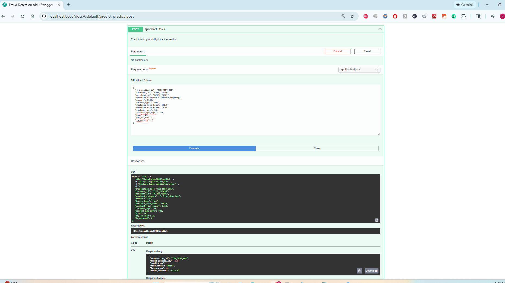

# Real-Time Fraud Detection ML Platform

[](https://www.python.org/)
[](https://kafka.apache.org/)
[](https://www.docker.com/)
[](https://fastapi.tiangolo.com/)

I built this to learn Kafka past the quickstart level: a producer at 100 TPS, a consumer that scores each transaction with LightGBM behind FastAPI, predictions and latencies in Postgres, metrics in Prometheus. Scoring P99 came out at 1.12ms. The data is synthetic (100k rows, 2,034 fraud) and it all runs on one laptop, so the numbers mean the pipeline holds together. They don't mean it survives real payment traffic.

---

## What I'd fix

Things I know are wrong or lazy, in rough order of how much they'd hurt in production:

- The consumer opens a new Postgres connection for every prediction (`kafka_consumer.py`). 100 TPS means 100 connections a second, so Postgres falls over before Kafka does. There's a `/predict/batch` endpoint in `main.py` that I wrote and never used. Pooling plus the batch endpoint is the obvious fix.
- The fraud threshold is 0.5 because that's what the examples use. With 2,034 fraud rows in 100,000, a classifier that never fires is already ~98% accurate. The cutoff has to come off the PR curve, weighted by what a miss costs. Not done yet.
- If the model pickle is missing, the API silently scores with a rule (`amount > 1000` gets 0.8) and keeps returning 200s. `/health` reports `model_loaded: false` but nothing alerts on it. It should fail the deploy or page someone, not improvise.
- Most of the 1.12ms is FastAPI overhead: request parsing, Pydantic, a one-row DataFrame built per call. LightGBM itself takes microseconds. If latency ever actually mattered, the DataFrame goes first, not the model.
- Offsets auto-commit and the insert is `ON CONFLICT (transaction_id) DO NOTHING`. Not exactly-once, but replays are no-ops, which is the property I actually wanted.

---

## How it works

```
Kafka producer ──▶ Kafka topic ──▶ Python consumer ──▶ FastAPI /predict ──▶ PostgreSQL
(100 TPS)                        (50 msg batches)      (LightGBM, P99 1.12ms)      │
                                                                                    ▼
                                                                              Prometheus ──▶ Grafana
                                                                              (latency percentiles,
                                                                               fraud rate, throughput)
```

1. `data/generate_synthetic_data.py` writes 100,000 labeled transactions (2,034 fraud, 2.03%) to `data/raw/`.
2. The producer streams them at 100 TPS into a partitioned topic.
3. The consumer reads in 50-message batches and posts each transaction to `/predict`.
4. FastAPI scores with LightGBM (P50 0.45ms, P95 0.89ms, P99 1.12ms) and the consumer persists ID, amount, probability, and latency to PostgreSQL.
5. Prometheus scrapes `/metrics`; Grafana renders throughput, latency percentiles, and detection rate.

---

## Dashboards

Grafana during a 100 TPS run:


Prediction latency sum over 5m, from Prometheus:


OpenAPI docs are at `/docs`:



---

## Measured results

| Metric | Value | How it was measured |
|--------|-------|---------------------|
| Scoring latency P50 | 0.45ms | Prometheus histogram on `/predict`, single sample, no batching |
| Scoring latency P95 | 0.89ms | Same |
| Scoring latency P99 | 1.12ms | Same |
| Producer throughput | 100 TPS | Rate-limited loop in `kafka_producer.py` |
| Training data | 100,000 rows, 2.03% fraud | Generator output |
| Fraud detected in demo run | ~2% of 180+ scored transactions | Row count in the `predictions` table |

Training runs and parameters are in MLflow (`http://localhost:5000` when the stack is up, or `python view_mlflow_results.py`).

---

## Run it

```bash
# 1. Infrastructure (FastAPI :8000, Prometheus :9090, Grafana :3000, MLflow :5000, Airflow :8080)
cd docker && docker compose up -d

# 2. Python environment
conda create -n fraud-detection python=3.11 -y
conda activate fraud-detection
pip install -r requirements.txt

# 3. Training data (100k rows, ~2% fraud)
python data/generate_synthetic_data.py

# 4. Pipeline, three terminals
python src/api/main.py                          # scoring API
python src/data_ingestion/kafka_producer.py     # 100 TPS stream
python src/data_ingestion/kafka_consumer.py     # scoring consumer
```

Verify:

```bash
docker exec -it fraud-postgres psql -U fraud_user -d fraud_detection \
  -c "SELECT COUNT(*) FROM predictions;"

curl -X POST http://localhost:8000/predict \
  -H "Content-Type: application/json" \
  -d '{"transaction_id": "TEST_001", "customer_id": "CUST_123", "merchant_id": "MERCH_456",
       "merchant_category": "online_shopping", "amount": 1500.00, "device_type": "web",
       "distance_from_home": 450.0, "merchant_risk_score": 0.65, "customer_age": 35,
       "account_age_days": 730, "hour": 14, "day_of_week": 2, "is_weekend": 0}'
```

API docs at `http://localhost:8000/docs`. Grafana login is `admin/admin`.

---

## Structure

```
├── data/generate_synthetic_data.py   # labeled transaction generator
├── src/
│   ├── data_ingestion/               # kafka_producer.py, kafka_consumer.py
│   ├── api/main.py                   # FastAPI scoring service
│   └── utils/
├── docker/                           # docker-compose.yml, init-db.sql
├── monitoring/                       # prometheus.yml, grafana/
├── airflow/                          # batch DAGs
├── artifacts/                        # trained model artifacts
└── tests/                            # test_api.py
```

---

## License

MIT
